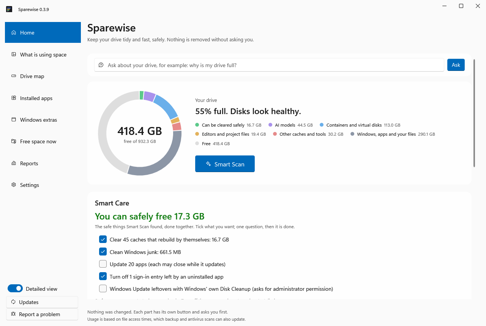
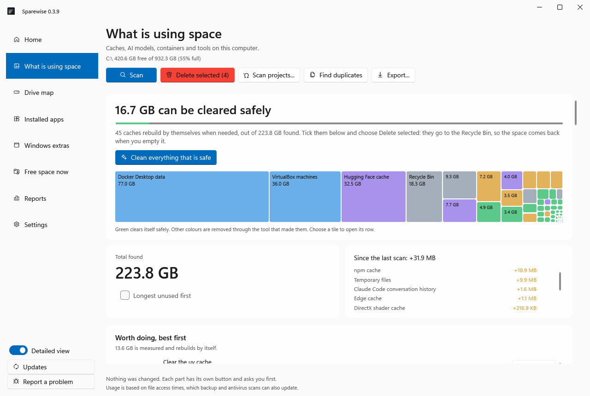

# Sparewise

**See why your Windows drive is full, and free space safely.**

Sparewise finds the space that developer and AI tools quietly fill: package caches, local AI
models, Docker and WSL disks, browser and editor caches, plus ordinary Windows clutter. It tells
you what each item is and whether it comes back by itself. It frees space only when you say so,
and anything it moves can be put back.

**[Get it from the Microsoft Store](https://apps.microsoft.com/detail/9NHXHFH3CF1B)** · [Download the installer](../../releases/latest/download/Sparewise-win-Setup.exe) · [All downloads](../../releases/latest) · `npx sparewise` · Windows 10 and 11, x64 and ARM · Free

**[▶ Watch the 52-second video](docs/sparewise.mp4)**: what Sparewise finds, clears safely and can undo.



## Why Sparewise

- **What it removes can be put back.** It goes to the Recycle Bin or an undo window, and comes back with one click.
- **Knows what rebuilds itself.** Only caches that come back on their own are offered, each with a tested rule, not a guess.
- **Built for developers and AI users.** Model folders, Docker and WSL disks, and AI coding tools' caches, measured one by one.
- **Finds what you keep twice.** The same npm package in many projects, the same Python library in many environments, the same AI model in two tools, measured with what storing it once would save.
- **Hibernates old projects.** An idle project becomes one checked archive without node_modules or build folders; open it to bring the project back.
- **Explains a slow PC honestly.** A nearly full drive, memory that is really short, a program growing for days, a restart waiting. No "RAM booster" tricks.
- **Works with your AI assistant.** Claude, Codex and other MCP clients can plan and free space, only within limits you set, with every change recorded and undoable.
- **No telemetry, no account.** Nothing leaves your PC.

---

## Quick start

| You want | Do this |
|---|---|
| **The app** (recommended) | Install from the [Microsoft Store](https://apps.microsoft.com/detail/9NHXHFH3CF1B): no warning from Windows, updates through the Store. |
| **The app, direct download** | Download [`Sparewise-win-Setup.exe`](../../releases/latest/download/Sparewise-win-Setup.exe) and run it. It installs for your account only, needs no admin rights, and updates itself. |
| **No install** | Download [`Sparewise-win-x64.zip`](../../releases/latest/download/Sparewise-win-x64.zip) (or [`arm64`](../../releases/latest/download/Sparewise-win-arm64.zip) for ARM laptops), unzip it, and run `Sparewise.App.exe`. |
| **Command line** | `npx sparewise`. Needs [Node.js](https://nodejs.org); see the [npm page](https://www.npmjs.com/package/sparewise). |

**The direct download may make Windows warn the first time** ("Windows protected your PC") because
the installer is not code-signed yet (the Microsoft Store version is signed by Microsoft). Choose **More info → Run anyway**. Each release lists SHA-256 checksums,
so you can check that a download is the genuine one.

## What it finds

- **Developer caches:** npm, pnpm, Yarn, pip, uv, conda, Cargo, Go, Gradle, Maven, NuGet and more
- **AI:** Ollama, LM Studio and Hugging Face models one by one, with when each was last loaded; caches of Cursor, Claude, Copilot, Codex and other AI coding tools
- **Containers and virtual disks:** Docker and WSL disks that never shrink by themselves
- **Projects and editors:** node_modules, virtual environments and build folders (never one you committed to git), old VS Code, Cursor and Windsurf extensions, git history waiting to be packed
- **Windows:** installers apps keep after updating, temporary files, update leftovers, old installers in Downloads, browser caches, the Recycle Bin, hibernation file
- **Your own files:** large videos, duplicates and folders you have not opened in months. Reported only: Sparewise never removes these by itself.



## How it keeps you safe

- **Scanning changes nothing.**
- **It asks first,** every time.
- **Everything can be put back.** What Sparewise removes goes to the Recycle Bin or an undo window, and it never empties the Recycle Bin. The one exception: Windows' own Disk Cleanup, which Sparewise can start for Windows Update leftovers, deletes permanently, and Windows asks for administrator permission first.
- **Only things that come back by themselves** (caches that rebuild) are offered for clearing, each with a tested safety rule and the evidence behind it.
- **Honest results.** It measures what was actually freed. Files a program has open stay where they are, and it says so.
- **Private.** No account, no telemetry; nothing about your PC is sent anywhere.

## For AI assistants

Sparewise is also an MCP server, so Claude, Cursor, VS Code, Claude Code and Codex can ask why
your drive is full, plan a cleanup and, only within limits you set, apply it. They can never
delete anything permanently.

- **In the app:** Settings → *Connect AI assistants*, one click per assistant.
- **From a terminal:**

```
claude mcp add sparewise -- npx -y sparewise mcp
codex mcp add sparewise -- npx -y sparewise mcp
```

## Questions

**Is it free?** Yes, everything is free to use today. Later versions may add paid features; the
version you have keeps the terms it came with (see [LICENSE](LICENSE)).

**Where is the source code?** Sparewise is closed source. The "Source code" links that GitHub
adds to every release contain only this README and the license files, not the program.

**Does it need administrator rights?** No. The few extras that use Windows' own admin tools (the
fast drive map, Disk Cleanup) ask first, and you can say no.

**Something went wrong or looks wrong?** Choose *Report a problem* in the app, or
[open an issue](../../issues/new). Questions and ideas are welcome in [Discussions](../../discussions).

## Like it?

If Sparewise freed space for you, a ⭐ on this page helps other people find it.
Problems and ideas are welcome in [Issues](../../issues).

## License

Free to use; proprietary. See [LICENSE](LICENSE) and [third-party notices](THIRD-PARTY-NOTICES.md).
